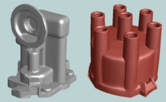
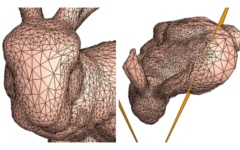
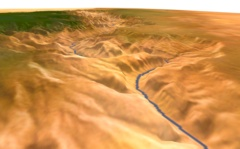
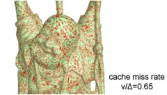
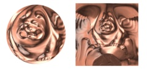

# Mesh Processing Library

[](https://github.com/hhoppe/Mesh-processing-library/actions/workflows/ci.yml)
[](https://github.com/hhoppe/Mesh-processing-library/actions/workflows/demos.yml)
[](https://github.com/hhoppe/Mesh-processing-library/actions/workflows/sanitizers.yml)


[](https://github.com/hhoppe/Mesh-processing-library/blob/main/LICENSE)

<!--
Preview exact GitHub rendering using "env grip"; it automatically calls GitHub API and serves webpage; really nice.
GitHub-specific syntax: https://help.github.com/categories/writing-on-github/
Nice docs in http://daringfireball.net/projects/markdown/syntax

[//]: # (Another way to insert comments -- after a blank line)
-->


This package contains C++ libraries and programs demonstrating mesh processing research
published from 1992 to 2003, mostly in ACM SIGGRAPH:
surface reconstruction from unorganized points, mesh optimization, subdivision surface fitting,
mesh simplification, progressive meshes and geomorphs, view-dependent mesh refinement, smooth terrain level-of-detail,
progressive simplicial complexes, optimized mesh traversal, and spherical parameterization.
The source code has been updated to modern C++ style and for cross-platform use.


<em>Results rendered by the viewer `G3dOGL`.
Top: a set of points, the mesh reconstructed from it, and the fitted subdivision surface;
a spherical remesh; a progressive simplicial complex.
Bottom: a progressive mesh at a coarse and at its full resolution; view-dependent refinement of a terrain.</em>


## Publications and associated programs/demos

<table id="publications">

 <tr id="pub_recon">
  <td width="266">
   
  </td>
  <td>
   <div><b><a href="https://hhoppe.com/proj/recon/">Surface reconstruction from unorganized points</a></b>.</div>
   <div>Hugues Hoppe, Tony DeRose, Tom Duchamp, John McDonald, Werner Stuetzle.</div>
   <div><cite>ACM SIGGRAPH 1992 Proceedings</cite>. (<a href="https://dl.acm.org/doi/book/10.1145/3596711"><em>2023 Seminal Paper</em></a>.)</div>
   <div><em>Signed-distance field estimated from a set of unoriented noisy points.</em></div>
   <div>Programs: <a href="progs/README.md#prog_recon"><code>Recon</code></a></div>
   <div>Demos: <code>create_recon_*</code>, <code>view_recon_*</code></div>
  </td>
 </tr>

 <tr id="pub_meshopt">
  <td width="266">
   
  </td>
  <td>
   <div><b><a href="https://hhoppe.com/proj/meshopt/">Mesh optimization</a></b>.</div>
   <div>Hugues Hoppe, Tony DeRose, Tom Duchamp, John McDonald, Werner Stuetzle.</div>
   <div><cite>ACM SIGGRAPH 1993 Proceedings</cite>.</div>
   <div><em>Exploration of the space of triangle meshes to balance model fidelity and conciseness.</em></div>
   <div>Programs: <a href="progs/README.md#prog_Meshfit"><code>Meshfit</code></a></div>
   <div>Demos: <code>create_recon_*</code>, <code>view_recon_*</code>, <code>create_simplified_using_meshopt</code>, <code>view_simplified_using_meshopt</code></div>
  </td>
 </tr>

 <tr id="pub_psrecon">
  <td width="266">
   
  </td>
  <td>
   <div><b><a href="https://hhoppe.com/proj/psrecon/">Piecewise smooth surface reconstruction</a></b>.</div>
   <div>Hugues Hoppe, Tony DeRose, Tom Duchamp, Michael Halstead, Hubert Jin, John McDonald, Jean Schweitzer, Werner Stuetzle.</div>
   <div><cite>ACM SIGGRAPH 1994 Proceedings</cite>.</div>
   <div><em>Subdivision surfaces with sharp features, and their automatic creation by data fitting.</em></div>
   <div>Programs: <a href="progs/README.md#prog_Subdivfit"><code>Subdivfit</code></a></div>
   <div>Demos: <code>create_recon_cactus</code>, <code>view_recon_cactus</code></div>
  </td>
 </tr>

 <tr id="pub_pm">
  <td width="266">
   
  </td>
  <td>
   <div><b><a href="https://hhoppe.com/proj/pm/">Progressive meshes</a></b>.</div>
   <div>Hugues Hoppe.</div>
   <div><cite>ACM SIGGRAPH 1996 Proceedings</cite>. (<a href="https://dl.acm.org/doi/book/10.1145/3596711"><em>2023 Seminal Paper</em></a>.)</div>
   <div><em>Efficient, lossless, continuous-resolution representation of surface triangulations.</em></div>
   <div>Programs: <a href="progs/README.md#prog_MeshSimplify"><code>MeshSimplify</code></a>, <a href="progs/README.md#prog_Filterprog"><code>Filterprog</code></a></div>
   <div>Demos: <code>create_geomorphs</code>, <code>view_geomorphs</code></div>
  </td>
 </tr>

 <tr id="pub_efficientpm">
  <td width="266">
   
  </td>
  <td>
   <div><b><a href="https://hhoppe.com/proj/efficientpm/">Efficient implementation of progressive meshes</a></b>.</div>
   <div>Hugues Hoppe.</div>
   <div><cite>Computers &amp; Graphics</cite>, 22(1), 1998.</div>
   <div><em>Progressive mesh data structures compatible with GPU vertex buffers.</em></div>
   <div>Programs: <a href="progs/README.md#prog_FilterPM"><code>FilterPM</code></a>, <a href="progs/README.md#prog_G3dOGL"><code>G3dOGL</code></a></div>
   <div>Demos: <code>create_pm_club</code>, <code>view_pm_club</code>, <code>determine_approximation_error</code></div>
  </td>
 </tr>

 <!--<tr id="pub_newqem">
     <td width="266">
      
     </td>
     <td>
      <div><b><a href="https://hhoppe.com/proj/newqem/">New quadric metric for simplifying meshes with appearance attributes</a></b>.</div>
      <div>Hugues Hoppe.</div>
      <div><cite>IEEE Visualization 1999 Conference</cite>.</div>
      <div><em>Efficient simplification metric designed around correspondence in 3D space.</em></div>
      <div>Programs: <a href="progs/README.md#prog_MeshSimplify"><code>MeshSimplify</code></a></div>
      <div>Demos: <code>create_pm_gaudipark</code>, <code>view_pm_gaudipark</code></div>
     </td>
 </tr>-->

 <tr id="pub_vdrpm">
  <td width="266">
   
  </td>
  <td>
   <div><b><a href="https://hhoppe.com/proj/vdrpm/">View-dependent refinement of progressive meshes</a></b>.</div>
   <div>Hugues Hoppe.</div>
   <div><cite>ACM SIGGRAPH 1997 Proceedings</cite>.</div>
   <div><em>Lossless multiresolution structure for incremental selective refinement/coarsening.</em></div>
   <div>Programs: <a href="progs/README.md#prog_FilterPM"><code>FilterPM</code></a>, <a href="progs/README.md#prog_G3dOGL"><code>G3dOGL</code></a></div>
   <div>Demos: <code>create_sr_office</code>, <code>view_sr_office</code></div>
  </td>
 </tr>

 <tr id="pub_svdlod">
  <td width="266">
   
  </td>
  <td>
   <div><b><a href="https://hhoppe.com/proj/svdlod/">Smooth view-dependent level-of-detail control and its application to terrain rendering</a></b>.</div>
   <div>Hugues Hoppe.</div>
   <div><cite>IEEE Visualization 1998 Conference</cite>. (<a href="https://ieeevis.org/year/2023/info/awards/test-of-time-awards#scivis"><em>2023 Test of Time Award</em></a>.)</div>
   <div><em>Visually smooth adaptation of mesh refinement using cascaded temporal geomorphs.</em></div>
   <div>Programs: <a href="progs/README.md#prog_StitchPM"><code>StitchPM</code></a>, <a href="progs/README.md#prog_G3dOGL"><code>G3dOGL</code></a></div>
   <div>Demos: <code>create_terrain_hierarchy</code>, <code>view_terrain_hierarchy</code>, <code>create_sr_terrain</code>, <code>view_sr_terrain</code>, <code>view_gcanyon_*</code></div>
  </td>
 </tr>

 <tr id="pub_psc">
  <td width="266">
   
  </td>
  <td>
   <div><b><a href="https://hhoppe.com/proj/psc/">Progressive simplicial complexes</a></b>.</div>
   <div>Jovan Popovic, Hugues Hoppe.</div>
   <div><cite>ACM SIGGRAPH 1997 Proceedings</cite>.</div>
   <div><em>Progressive encoding of both topology and geometry.</em></div>
   <div>Programs: <a href="progs/README.md#prog_G3dOGL"><code>G3dOGL</code></a></div>
   <div>Demos: <code>view_psc_drumset</code></div>
  </td>
 </tr>

 <tr id="pub_tvc">
  <td width="266">
   
  </td>
  <td>
   <div><b><a href="https://hhoppe.com/proj/tvc/">Optimization of mesh locality for transparent vertex caching</a></b>.</div>
   <div>Hugues Hoppe.</div>
   <div><cite>ACM SIGGRAPH 1999 Proceedings</cite>.</div>
   <div><em>Face reordering for efficient GPU vertex cache, advocating a FIFO policy.</em></div>
   <div>Programs: <a href="progs/README.md#prog_MeshReorder"><code>MeshReorder</code></a></div>
   <div>Demos: <code>create_vertexcache_bunny</code>, <code>view_vertexcache_bunny</code></div>
  </td>
 </tr>

 <tr id="pub_sphereparam">
  <td width="266">
   
  </td>
  <td>
   <div><b><a href="https://hhoppe.com/proj/sphereparam/">Spherical parameterization and remeshing</a></b>.</div>
   <div>Emil Praun, Hugues Hoppe.</div>
   <div><cite>ACM SIGGRAPH 2003 Proceedings</cite>.</div>
   <div><em>Robust mapping of a surface onto a sphere, allowing 2D-grid resampling.</em></div>
   <div>Programs: <a href="progs/README.md#prog_SphereParam"><code>SphereParam</code></a>, <a href="progs/README.md#prog_SphereSample"><code>SphereSample</code></a></div>
   <div>Demos: <code>create_spherical_param_bunny</code>, <code>view_spherical_param_bunny</code></div>
  </td>
 </tr>

</table>


## Building

The code compiles with recent C++23 compilers (`gcc`, `clang`, or Microsoft Visual C++)
on most platforms (Windows, Linux, WSL, macOS), or within a Docker container.
The steps are summarized here; see [`make/README.md`](make/README.md) for the requirements,
the build configurations and options, the [unit tests](make/README.md#unit-tests),
and more on the [demos](make/README.md#demos).

- On **Linux, WSL, or macOS**, using GNU `make`:

  ```shell
  make -j        # Build all programs (into bin/unix) and run the unit tests.
  make -j demos  # Also create, check, and view the demo results.
  ```

  Prerequisites:
  - Ubuntu: `sudo apt install make clang libgl-dev libx11-dev libjpeg-dev libpng-dev zlib1g-dev ffmpeg`
  - macOS: `brew install --cask xquartz && brew install ffmpeg`

- On **Windows**, open `mesh_processing.sln` in Microsoft Visual Studio and build the solution
  (typically as `ReleaseMD - x64`, into `bin/msbuild`), then create and view the demo results:

  ```shell
  demos\all_demos_create_results.bat
  demos\all_demos_view_results.bat
  ```

  The `make` commands also work on Windows, in a Cygwin or MSYS2 shell, with a choice of four configurations.

- With **Docker**, on any platform:

  ```shell
  docker build -f make/Dockerfile -t mesh-processing .  # Build programs and run the unit tests.
  docker run -it --rm mesh-processing                   # Start a shell with programs in the PATH.
  ```

Pressing the <kbd>Esc</kbd> key closes any open program window.
The demo scripts are in [`demos`](https://github.com/hhoppe/Mesh-processing-library/tree/main/demos#demos).


## Programs

The programs read from `stdin` (or from files) and write to `stdout`, so that they combine into pipelines.
For example, the command

```shell
FilterPM demos/data/standingblob.pm -info -nfaces 1000 -outmesh | \
  Filtermesh -info -signeddistcontour 60 -genus | \
  G3dOGL -key DmDe
```

extracts a mesh with 1000 faces from a progressive mesh,
remeshes it as the zero isocontour of its signed-distance function on a 60<sup>3</sup> grid,
reports the genus of the new mesh, and shows it in an interactive viewer.

| Program | Purpose |
| --- | --- |
| [`Recon`] | Reconstruct a triangle mesh from unorganized 3D points (or a curve from 2D points). |
| [`Meshfit`] | Optimize the connectivity and geometry of a mesh to fit a set of points. |
| [`Polyfit`] | Optimize a polyline to fit a set of 2D points. |
| [`Subdivfit`] | Fit a piecewise smooth subdivision surface to a set of points. |
| [`MeshDistance`] | Measure the differences (in geometry, color, and normals) between two meshes. |
| [`MeshSimplify`] | Simplify a mesh using a sequence of edge collapses, and record them. |
| [`Filterprog`] | Encode a base mesh and its recorded edge collapses as a progressive mesh. |
| [`FilterPM`] | Process a progressive mesh (`*.pm`), e.g., to extract meshes and geomorphs of given complexities. |
| [`StitchPM`] | Stitch the progressive meshes of adjacent terrain tiles into one. |
| [`MinCycles`] | Remove topological noise from a mesh by pinching off its smallest nonseparating cycles. |
| [`MeshReorder`] | Reorder the faces (and vertices) of a mesh for efficient GPU vertex caching. |
| [`SphereParam`] | Parameterize a mesh onto the sphere while minimizing stretch. |
| [`SphereSample`] | Resample a spherically parameterized mesh, to create remeshes and texture images. |
| [`Filtermesh`] | Process a mesh (`*.m`). |
| [`Filterimage`] | Process an image, or assemble images into a grid. |
| [`Filtervideo`] | Process a video, or assemble videos into a grid. |
| [`Filtera3d`] | Process a geometry stream of polygons, polylines, and points (`*.a3d`). |
| [`Filterframe`] | Process a stream of coordinate frames (`*.frame`). |
| [`G3dOGL`] | Show meshes, progressive meshes, and geometry streams interactively; save images and videos. |
| [`G3dVec`] | Show hidden-line-removed wireframe renderings; save vector PostScript figures. |
| [`VideoViewer`] | Show images and videos in an interactive viewer, with simple editing. |

[`Recon`]: progs/README.md#prog_recon
[`Meshfit`]: progs/README.md#prog_Meshfit
[`Polyfit`]: progs/README.md#prog_Polyfit
[`Subdivfit`]: progs/README.md#prog_Subdivfit
[`MeshDistance`]: progs/README.md#prog_MeshDistance
[`MeshSimplify`]: progs/README.md#prog_MeshSimplify
[`Filterprog`]: progs/README.md#prog_Filterprog
[`FilterPM`]: progs/README.md#prog_FilterPM
[`StitchPM`]: progs/README.md#prog_StitchPM
[`MinCycles`]: progs/README.md#prog_MinCycles
[`MeshReorder`]: progs/README.md#prog_MeshReorder
[`SphereParam`]: progs/README.md#prog_SphereParam
[`SphereSample`]: progs/README.md#prog_SphereSample
[`Filtermesh`]: progs/README.md#prog_Filtermesh
[`Filterimage`]: progs/README.md#prog_Filterimage
[`Filtervideo`]: progs/README.md#prog_Filtervideo
[`Filtera3d`]: progs/README.md#prog_Filtera3d
[`Filterframe`]: progs/README.md#prog_Filterframe
[`G3dOGL`]: progs/README.md#prog_G3dOGL
[`G3dVec`]: progs/README.md#prog_G3dOGL
[`VideoViewer`]: progs/README.md#prog_VideoViewer

The directory `bin` also contains scripts:
`mesh_to_pm` creates a progressive mesh from a mesh (using `MeshSimplify` and `Filterprog`),
`pm_simplify` further simplifies the base mesh of a progressive mesh, and
`obj_to_mesh`, `ply_to_mesh`, `mesh_to_obj`, and `mesh_to_ply` convert between the mesh format (`*.m`) and
Wavefront `*.obj` or Stanford `*.ply` files.

All programs recognize the argument `--help` (or `-?`) to show their many options.
See [`progs/README.md`](progs/README.md) for a description of each program with example commands,
and for the [file formats](progs/README.md#file-formats).


## Libraries

The library [`libHh`](https://github.com/hhoppe/Mesh-processing-library/tree/main/libHh#libhh)
contains the main reusable classes.
All files include `Hh.h` which sets up a common cross-platform environment.

The libraries [`libHwWindows`](libHwWindows) and [`libHwX`](libHwX)
define implementations of a simple windowing interface (class `Hw`),
under `Win32` and the X Window System, respectively.
Both implementations support `OpenGL` rendering.

Each program (e.g., `Filtermesh`) lives in its own subdirectory of
[`progs`](https://github.com/hhoppe/Mesh-processing-library/tree/main/progs#programs)
and links against these libraries.


## License

See <a href="LICENSE">`LICENSE`</a>.
This project has adopted the <a href="https://opensource.microsoft.com/codeofconduct/">Microsoft Open Source Code of Conduct</a>.  For more information see the <a href="https://opensource.microsoft.com/codeofconduct/faq/">Code of Conduct FAQ</a> or contact <a href="mailto:opencode@microsoft.com">opencode@microsoft.com</a> with any additional questions or comments.
