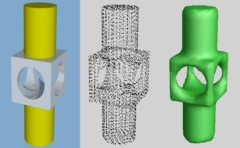
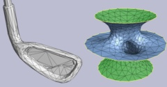
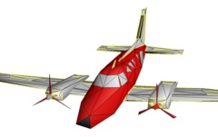
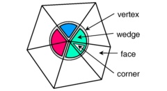
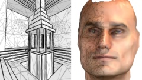
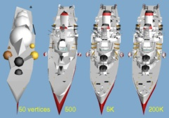

# Mesh Processing Library

<!--
Preview exact GitHub rendering using "env grip"; it automatically calls GitHub API and serves webpage; really nice.
GitHub-specific syntax: https://help.github.com/categories/writing-on-github/
Nice docs in http://daringfireball.net/projects/markdown/syntax

[//]: # (Another way to insert comments -- after a blank line)
-->

## Overview

This package contains C++ libraries and programs demonstrating mesh processing research
published from 1992 to 2003, mostly in ACM SIGGRAPH:

- <em>surface reconstruction</em> (from unorganized, unoriented points)
- <em>mesh optimization</em>
- <em>subdivision surface fitting</em>
- <em>mesh simplification</em>
- <em>progressive meshes</em> (level-of-detail representation)
- <em>geomorphs</em> (smooth transitions across LOD meshes)
- <em>view-dependent mesh refinement</em>
- <em>smooth terrain LOD</em>
- <em>progressive simplicial complexes</em>
- <em>optimized mesh traversal</em> (for transparent vertex caching)
- <em>spherical parameterization</em>

The source code has been updated to modern C++ style and for cross-platform use.

## Publications and associated programs/demos

<table id="publications">

 <tr id="pub_recon">
  <td class="lcell">
   
  </td>
  <td class="rcell">
   
<a href="https://hhoppe.com/proj/recon/">Surface reconstruction from unorganized points</a>.

   
Hugues Hoppe, Tony DeRose, Tom Duchamp, John McDonald, Werner Stuetzle.

   
<cite>ACM SIGGRAPH 1992 Proceedings</cite>. (<a href="https://dl.acm.org/doi/book/10.1145/3596711"><em>2023 Seminal Paper</em></a>.)

   
<em>Signed-distance field estimated from a set of unoriented noisy points.</em>

   
Programs: <a href="progs/README.md#prog_recon"><code>Recon</code></a>

   
Demos: <code>create_recon_*</code>, <code>view_recon_*</code>

  </td>
 </tr>

 <tr id="pub_meshopt">
  <td class="lcell">
   
  </td>
  <td class="rcell">
   
<a href="https://hhoppe.com/proj/meshopt/">Mesh optimization</a>.

   
Hugues Hoppe, Tony DeRose, Tom Duchamp, John McDonald, Werner Stuetzle.

   
<cite>ACM SIGGRAPH 1993 Proceedings</cite>.

   
<em>Traversing the space of triangle meshes to optimize model fidelity and conciseness.</em>

   
Programs: <a href="progs/README.md#prog_Meshfit"><code>Meshfit</code></a>

   
Demos: <code>create_recon_*</code>, <code>view_recon_*</code>, <code>create_simplified_using_meshopt</code>, <code>view_simplified_using_meshopt</code>

  </td>
 </tr>

 <tr id="pub_psrecon">
  <td class="lcell">
   
  </td>
  <td class="rcell">
   
<a href="https://hhoppe.com/proj/psrecon/">Piecewise smooth surface reconstruction</a>.

   
Hugues Hoppe, Tony DeRose, Tom Duchamp, Michael Halstead, Hubert Jin, John McDonald, Jean Schweitzer, Werner Stuetzle.

   
<cite>ACM SIGGRAPH 1994 Proceedings</cite>.

   
<em>Subdivision surfaces with sharp features, and their automatic creation by data fitting.</em>

   
Programs: <a href="progs/README.md#prog_Subdivfit"><code>Subdivfit</code></a>

   
Demos: <code>create_recon_cactus</code>, <code>view_recon_cactus</code>

  </td>
 </tr>

 <tr id="pub_pm">
  <td class="lcell">
   
  </td>
  <td class="rcell">
   
<a href="https://hhoppe.com/proj/pm/">Progressive meshes</a>.

   
Hugues Hoppe.

   
<cite>ACM SIGGRAPH 1996 Proceedings</cite>. (<a href="https://dl.acm.org/doi/book/10.1145/3596711"><em>2023 Seminal Paper</em></a>.)

   
<em>Efficient, lossless, continuous-resolution representation of surface triangulations.</em>

   
Programs: <a href="progs/README.md#prog_MeshSimplify"><code>MeshSimplify</code></a>, <a href="progs/README.md#prog_Filterprog"><code>Filterprog</code></a>

   
Demos: <code>create_geomorphs</code>, <code>view_geomorphs</code>

  </td>
 </tr>

 <tr id="pub_efficientpm">
  <td class="lcell">
   
  </td>
  <td class="rcell">
   
<a href="https://hhoppe.com/proj/efficientpm/">Efficient implementation of progressive meshes</a>.

   
Hugues Hoppe.

   
<cite>Computers &amp; Graphics</cite>, 22(1), 1998.

   
<em>Progressive mesh data structures compatible with GPU vertex buffers.</em>

   
Programs: <a href="progs/README.md#prog_FilterPM"><code>FilterPM</code></a>, <a href="progs/README.md#prog_G3dOGL"><code>G3dOGL</code></a>

   
Demos: <code>create_pm_club</code>, <code>view_pm_club</code>, <code>determine_approximation_error</code>

  </td>
 </tr>

 <!--<tr id="pub_newqem">
     <td class="lcell">
      
     </td>
     <td class="rcell">
      
<a href="https://hhoppe.com/proj/newqem/">New quadric metric for simplifying meshes with appearance attributes</a>.

      
Hugues Hoppe.

      
<cite>IEEE Visualization 1999 Conference</cite>.

      
<em>Efficient simplification metric designed around correspondence in 3D space.</em>

      
Programs: <a href="progs/README.md#prog_MeshSimplify"><code>MeshSimplify</code></a>

      
Demos: <code>create_pm_gaudipark</code>, <code>view_pm_gaudipark</code>

     </td>
 </tr>-->

 <tr id="pub_vdrpm">
  <td class="lcell">
   
  </td>
  <td class="rcell">
   
<a href="https://hhoppe.com/proj/vdrpm/">View-dependent refinement of progressive meshes</a>.

   
Hugues Hoppe.

   
<cite>ACM SIGGRAPH 1997 Proceedings</cite>.

   
<em>Lossless multiresolution structure for incremental local refinement/coarsening.</em>

   
Programs: <a href="progs/README.md#prog_FilterPM"><code>FilterPM</code></a>, <a href="progs/README.md#prog_G3dOGL"><code>G3dOGL</code></a>

   
Demos: <code>create_sr_office</code>, <code>view_sr_office</code>

  </td>
 </tr>

 <tr id="pub_svdlod">
  <td class="lcell">
   
  </td>
  <td class="rcell">
   
<a href="https://hhoppe.com/proj/svdlod/">Smooth view-dependent level-of-detail control and its application to terrain rendering</a>.

   
Hugues Hoppe.

   
<cite>IEEE Visualization 1998 Conference</cite>. (<a href="https://ieeevis.org/year/2023/info/awards/test-of-time-awards#scivis"><em>2023 Test of Time Award</em></a>.)

   
<em>Visually smooth adaptation of mesh refinement using cascaded temporal geomorphs.</em>

   
Programs: <a href="progs/README.md#prog_StitchPM"><code>StitchPM</code></a>, <a href="progs/README.md#prog_G3dOGL"><code>G3dOGL</code></a>

   
Demos: <code>create_terrain_hierarchy</code>, <code>view_terrain_hierarchy</code>, <code>create_sr_terrain</code>, <code>view_sr_terrain</code>, <code>view_gcanyon_*</code>

  </td>
 </tr>

 <tr id="pub_psc">
  <td class="lcell">
   
  </td>
  <td class="rcell">
   
<a href="https://hhoppe.com/proj/psc/">Progressive simplicial complexes</a>.

   
Jovan Popovic, Hugues Hoppe.

   
<cite>ACM SIGGRAPH 1997 Proceedings</cite>.

   
<em>Progressive encoding of both topology and geometry.</em>

   
Programs: <a href="progs/README.md#prog_G3dOGL"><code>G3dOGL</code></a>

   
Demos: <code>view_psc_drumset</code>

  </td>
 </tr>

 <tr id="pub_tvc">
  <td class="lcell">
   
  </td>
  <td class="rcell">
   
<a href="https://hhoppe.com/proj/tvc/">Optimization of mesh locality for transparent vertex caching</a>.

   
Hugues Hoppe.

   
<cite>ACM SIGGRAPH 1999 Proceedings</cite>.

   
<em>Face reordering for efficient GPU vertex cache, advocating a FIFO policy.</em>

   
Programs: <a href="progs/README.md#prog_MeshReorder"><code>MeshReorder</code></a>

   
Demos: <code>create_vertexcache_bunny</code>, <code>view_vertexcache_bunny</code>

  </td>
 </tr>

 <tr id="pub_sphereparam">
  <td class="lcell">
   
  </td>
  <td class="rcell">
   
<a href="https://hhoppe.com/proj/sphereparam/">Spherical parameterization and remeshing</a>.

   
Emil Praun, Hugues Hoppe.

   
<cite>ACM SIGGRAPH 2003 Proceedings</cite>.

   
<em>Robust mapping of a surface onto a sphere, allowing 2D-grid resampling.</em>

   
Programs: <a href="progs/README.md#prog_SphereParam"><code>SphereParam</code></a>, <a href="progs/README.md#prog_SphereSample"><code>SphereSample</code></a>

   
Demos: <code>create_spherical_param_bunny</code>, <code>view_spherical_param_bunny</code>

  </td>
 </tr>

</table>

## Building, testing, and running the demos

See [`make/README.md`](make/README.md) for the requirements, for building the code
(using Microsoft Visual Studio, GNU `make`, or Docker), and for running the unit tests and the demos.

## Programs

See [`progs/README.md`](progs/README.md) for a description of each program with example commands,
and for the file formats.

## Libraries

The library <a href="https://github.com/hhoppe/Mesh-processing-library/tree/main/libHh">`libHh`</a>
contains the main reusable classes.
All files include `Hh.h` which sets up a common cross-platform environment.

The libraries <a href="https://github.com/hhoppe/Mesh-processing-library/tree/main/libHwWindows">`libHwWindows`</a>
and <a href="https://github.com/hhoppe/Mesh-processing-library/tree/main/libHwX">`libHwX`</a>
define different implementations of a simple windowing interface (class `Hw`),
under `Win32` and the X Window System, respectively.
Both implementations support `OpenGL` rendering.

Each program (e.g., `Filtermesh`) lives in its own subdirectory of
<a href="https://github.com/hhoppe/Mesh-processing-library/tree/main/progs">`progs`</a>
and links against these libraries.

See [`libHh/README.md`](libHh/README.md) for an overview of the classes in `libHh`.

## License

See <a href="LICENSE">`LICENSE`</a>.
This project has adopted the <a href="https://opensource.microsoft.com/codeofconduct/">Microsoft Open Source Code of Conduct</a>.  For more information see the <a href="https://opensource.microsoft.com/codeofconduct/faq/">Code of Conduct FAQ</a> or contact <a href="mailto:opencode@microsoft.com">opencode@microsoft.com</a> with any additional questions or comments.
