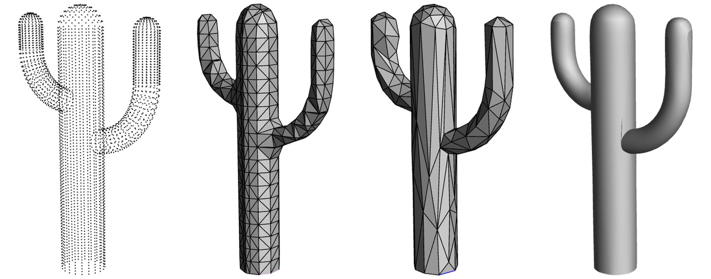
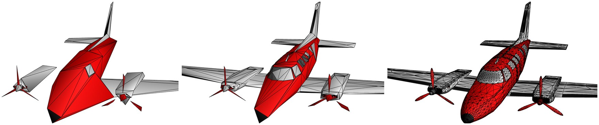
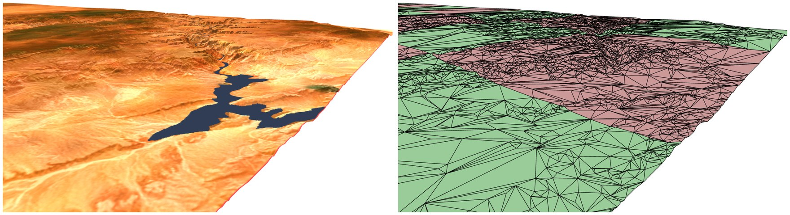
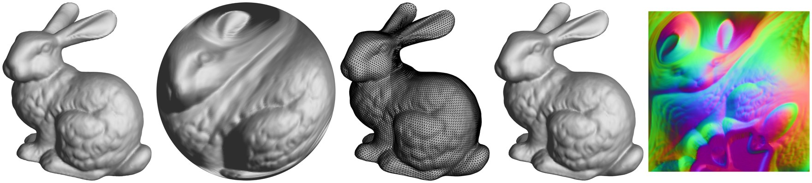
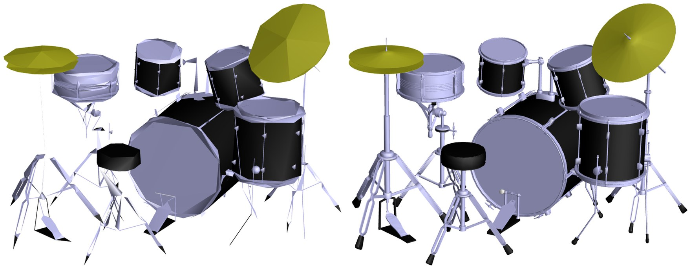
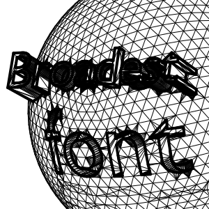

# Programs

This page describes the programs of the [Mesh Processing Library](../README.md), with example commands, and the
[file formats](#file-formats) that they read and write.


## Filter programs

All programs recognize the argument `--help` (or `-?`) to show their many options.

The programs `Filterimage`, `Filtermesh`, `Filtervideo`,
`FilterPM`, `Filtera3d`, and `Filterframe` are all designed to:
- read media from `stdin` (or from files or procedures specified as initial arguments),
- perform operations specified by arguments, and
- write media to `stdout` (unless `-nooutput` is specified).

### <a id="prog_Filterimage"></a>Filterimage

Processes an image.  For example, the command
```shell
Filterimage demos/data/gaudipark.png -rotate 20 -cropl 100 -cropr 100 \
  -filter lanczos6 -scaletox 100 -color 0 0 255 255 -boundary border -cropall -20 \
  -setalpha 255 -color 0 0 0 0 -drawrectangle 30% 30% -30% -30% -gdfill \
  -info -to jpg >gaudipark.new.jpg
```
- reads the specified image,
- rotates it 20 degrees counterclockwise (with the default reflection boundary rule),
- crops its left and right sides by 100 pixels,
- scales it uniformly to a horizontal resolution of 100 pixels using a 6&times;6 Lanczos filter,
- adds a 20-pixel blue border on all sides,
- adds an alpha channel and creates an undefined (`alpha=0`) rectangular region in the image center,
- fills this region using gradient-domain smoothing,
- outputs some statistics on pixel colors (to `stderr`), and
- writes the result to a file under a different encoding.

### <a id="prog_FilterPM"></a>FilterPM

Processes a progressive mesh (`*.pm`).  For example, the command
```shell
FilterPM demos/data/standingblob.pm -info -nfaces 1000 -outmesh | \
  Filtermesh -info -signeddistcontour 60 -genus | \
  G3dOGL -key DmDe
```
- reads a <em>progressive mesh</em> stream to construct a mesh with 1000 faces,
- reports statistics on the mesh geometry,
- remeshes the surface as the zero isocontour of its signed-distance function on a 60<sup>3</sup> grid,
- reports the new mesh genus, and
- shows the result in an interactive viewer,
  simulating the keypresses <kbd>Dm</kbd> to enable flat shading and <kbd>De</kbd> to make mesh edges visible.

### <a id="prog_Filtermesh"></a>Filtermesh

Processes a mesh (`*.m`).  For example, the command
```shell
FilterPM demos/data/spheretext.pm -nf 2000 -outmesh | \
  Filtermesh -angle 35 -silsubdiv -silsubdiv -mark | \
  G3dOGL -key DmDeDbJ---- -st demos/data/spheretext.s3d
```
- reads a 2000-face mesh, marks all edges with dihedral angle greater than 35 degrees as sharp,
- applies two steps of adaptive subdivision near these sharp edges, and
- shows the result flat-shaded (<kbd>Dm</kbd>), with edges (<kbd>De</kbd>),
  without backface culling (<kbd>Db</kbd>), spinning (<kbd>J</kbd>) somewhat slowly (<kbd>----</kbd>),
- starting from the view parameters stored in the `spheretext.s3d` file.

### <a id="prog_Filtervideo"></a>Filtervideo

Processes a video.  For example, the command
```shell
Filtervideo demos/data/palmtrees_small.mp4 -filter keys -scaleu 1.5 >palmtrees_small.scale1.5.mp4
```
- reads the video (entirely into memory),
- uniformly scales the two spatial dimensions by a factor 1.5 using the Keys bicubic filter, and
- saves the new video.

The command
```shell
Filtervideo demos/data/palmtrees_small.mp4 -info -trimbeg 4 -boundary clamped -trimend -20% \
    -tscale 1.5 -framerate 150% -croprectangle 50% 50% 400 240 -gamma 1.5 -bitrate 10m | \
  VideoViewer demos/data/palmtrees_small.mp4 - -key =an
```
- reads the video (entirely into memory),
- reports statistics on the color channels,
- trims off 4 frames at the beginning,
- adds repeated copies of the last frames (with length 20% of the video),
- temporally scales the content by a factor of 1.5 and adjusts the framerate accordingly,
- spatially crops a centered rectangle with width 400 pixels and height 240 pixels,
- adjusts the color gamma,
- sets the output bitrate to 10 megabits/sec, and
- shows the result (`-` for `stdin`) together with the original video in an interactive viewer,
- with keypress <kbd>=</kbd> to scale the window by 2, <kbd>a</kbd> to loop all (two) videos,
  and <kbd>n</kbd> to initially select the next video.

### <a id="prog_Filtera3d"></a>Filtera3d

Processes a geometry stream (`*.a3d`) of polygons, polylines, and points,
e.g., to cull, split, or join its elements; see the examples under [Recon](#prog_recon).

### <a id="prog_Filterframe"></a>Filterframe

Processes a stream of coordinate frames (`*.frame`), e.g., to transform, invert, or subsample them.


## Surface reconstruction

<div align="center">
<picture>
  <source media="(prefers-color-scheme: dark)" srcset="../.github/images/reconstruction_dark.jpg">
  
</picture>
</div>

<em>Points sampled near a cactus, the mesh reconstructed from them (`Recon`), the optimized mesh (`Meshfit`),
and the fitted subdivision surface (`Subdivfit`).</em>

### <a id="prog_recon"></a>Recon

This program reads a list of 3D (x, y, z) points assumed to be sampled near some unknown manifold surface,
and reconstructs an approximating triangle mesh.
For example,
```shell
Recon <demos/data/distcap.pts -samplingd 0.02 | \
  Filtermesh -genus -rmcomp 100 -fillholes 30 -triangulate -genus | tee distcap.recon.m | \
  G3dOGL -st demos/data/distcap.s3d -key DmDe
```
- reads the text file of points,
- reconstructs a triangle mesh assuming a max sample spacing (&delta;+&rho; in paper) of 2% of the bounding volume,
- reports the genus of this initial mesh,
- removes all connected components with fewer than 100 triangle faces,
- fills and triangulates any hole bounded by 30 or fewer mesh edges,
- reports the genus of the modified mesh,
- saves it to a file, and
- displays it interactively starting from a specified viewpoint, with flat-shaded faces (<kbd>Dm</kbd>)
  and mesh edges (<kbd>De</kbd>).

To show the progression of the Marching Cubes algorithm,
```shell
Recon <demos/data/distcap.pts -samplingd 0.02 -what c | \
  Filtera3d -split 30 | G3dOGL -key DCDb -st demos/data/distcap_backside.s3d -terse
```
- selects the 'c' (cubes) output stream,
- forces a frame refresh every 30 polygon primitives, and
- shows the result without display-list caching (<kbd>DC</kbd>) and without backface culling (<kbd>Db</kbd>).

To show a similar streaming reconstruction of the surface mesh,
```shell
Recon <demos/data/distcap.pts -samplingd 0.02 -what m | Filtermesh -toa3d | \
  Filtera3d -split 30 | \
  G3dOGL demos/data/distcap.pts -key DCDb -st demos/data/distcap_backside.s3d -terse -input -key _Jo
```
- selects the default 'm' (mesh) output stream,
- converts the mesh to a stream of polygons, and
- shows the points and streamed reconstruction with a slow (<kbd>_</kbd>) rotation (<kbd>J</kbd>)
  about the object frame (<kbd>o</kbd>).

The same program can also read a list of 2D (y, z) points to reconstruct an approximating curve:
```shell
Recon <demos/data/curve1.pts -samplingd 0.06 -grid 30 | \
  Filtera3d -joinlines | tee curve1.a3d | \
  G3dOGL demos/data/curve1.pts -input -st demos/data/curve1.s3d
```

### <a id="prog_Meshfit"></a>Meshfit

Given an initial mesh and a list of 3D points, this program optimizes both the mesh connectivity and
geometry to improve the fit, i.e., to minimize the squared distances from the points to the surface.
For example,
```shell
Meshfit -mfile distcap.recon.m -file demos/data/distcap.pts -crep 1e-5 -reconstruct | \
  tee distcap.opt.m | G3dOGL -st demos/data/distcap.s3d -key DmDe
```
- reads the previously reconstructed mesh and the original list of points,
- applies an optimized sequence of perturbations to improve both the mesh connectivity and geometry,
- using a specified tradeoff between mesh conciseness and fidelity
  (<var>c<sub>rep</sub></var>=1e-4 yields a coarser mesh),
- saves the result to a file, and displays it interactively.

The input points can also be sampled from an existing surface, for example:
```shell
Filtermesh demos/data/blob5.orig.m -randpts 10000 -vertexpts | \
  Meshfit -mfile demos/data/blob5.orig.m -file - -crep 1e-6 -simplify | \
  G3dOGL -st demos/data/blob5.s3d -key DmDe
```

To view the real-time fitting optimization,
```shell
Meshfit -mfile distcap.recon.m -file demos/data/distcap.pts \
  -crep 1e-5 -outmesh - -record -reconstruct | \
  G3dOGL -st demos/data/distcap.s3d -key DmDeDC -async -terse
```
- writes both the initial mesh and the stream of mesh modifications, and
- displays the changing mesh asynchronously with display-list caching disabled (<kbd>DC</kbd>).

### <a id="prog_Polyfit"></a>Polyfit

This related program performs a similar optimization of a 1D polyline (either open or closed)
to fit a set of 2D points.  For example,
```shell
Polyfit -pfile curve1.a3d -file demos/data/curve1.pts -crep 3e-4 -spring 1 -reconstruct | \
  G3dOGL demos/data/curve1.pts -input -st demos/data/curve1.s3d
```
- reads the previously reconstructed polyline and the original list of points,
- optimizes the vertex positions and reduces the number of line segments according to a representation cost, and
- displays the result together with the original points.

### <a id="prog_Subdivfit"></a>Subdivfit

In a subdivision surface representation, a coarse base mesh tagged with <em>sharp</em> edges
defines a <em>piecewise smooth</em> surface as the limit of a subdivision process.
Such a representation both improves geometric fidelity and leads to a more concise description.
```shell
Filtermesh distcap.opt.m -angle 52 -mark | \
  Subdivfit -mfile - -file demos/data/distcap.pts -crep 1e-5 -csharp .2e-5 -reconstruct >distcap.sub0.m
```
- reads the previously optimized mesh and tags all edges with dihedral angle greater than 52 degrees as <em>sharp</em>,
- loads this tagged mesh and the original list of points,
- optimizes the mesh connectivity, geometry, and assignment of sharp edges to fit a
  <em>subdivision surface</em> to the points,
- with a representation cost of `1e-5` per vertex and `.2e-5` per sharp edge, and
- saves the resulting optimized base mesh to a file.  (The overall process takes a few minutes.)

To view the result,
```shell
G3dOGL distcap.sub0.m "Subdivfit -mf distcap.sub0.m -nsub 2 -outn |" \
  -st demos/data/distcap.s3d -key DbNDmDe -hwdelay 5 -hwkey N
```
- reads the base mesh together with a second mesh obtained by applying two iterations of subdivision,
- disables backface culling (<kbd>Db</kbd>), and
  shows the first mesh (<kbd>N</kbd>) with flat-shaded faces and edges (<kbd>DmDe</kbd>),
- waits for 5 seconds, and displays the second mesh (<kbd>N</kbd>) as a smooth surface without edges.

### <a id="prog_MeshDistance"></a>MeshDistance

This program computes measures of differences between two meshes.
It samples a dense set of points from a first mesh and computes the
projections of each point onto the closest point on a second mesh.
```shell
MeshDistance -mfile distcap.recon.m -mfile distcap.opt.m -bothdir 1 -maxerror 1 -distance
```
- loads the earlier results of mesh reconstruction and mesh optimization,
- computes correspondences from points sampled on each mesh to the other mesh (in both directions), and
- reports differences in geometric distance, color, and surface normals,
  using both L<sup>2</sup> (rms) and L<sup>&infin;</sup> (max) norms.


## Mesh simplification

<picture>
  <source media="(prefers-color-scheme: dark)" srcset="../.github/images/progressive_mesh_dark.jpg">
  
</picture>

<em>A progressive mesh of an airplane, at three of its continuous levels of detail
(800, 3000, and 13,546 faces).</em>

Given a mesh, `MeshSimplify` applies a sequence of <em>edge collapse</em> operations
to simplify it to a coarse <em>base mesh</em> while trying to best preserve the appearance of the original model.
It supports many different simplification criteria, as well as face properties,
edges tagged as sharp, and vertex and corner attributes
(<var>n<sub>x</sub></var>,<var>n<sub>y</sub></var>,<var>n<sub>z</sub></var> normals,
<var>r</var>,<var>g</var>,<var>b</var> colors, and <var>u</var>,<var>v</var> texture coordinates).

For example,<a id="prog_MeshSimplify"></a>
```shell
MeshSimplify demos/data/club.orig.m -prog club.prog -simplify >club.base.m
```
- reads the original mesh and randomly samples points over its surface,
- progressively simplifies it by examining point residual distances, while recording changes to a `*.prog` file, and
- writes the resulting base mesh.

(Because the simplification is multithreaded, repeated runs produce slightly different results;
setting the environment variable `OMP_NUM_THREADS=1` makes them deterministic.)

We construct a concise <em>progressive mesh</em> by encoding the base mesh together
with the sequence of <em>vertex splits</em> that exactly recover the original mesh,
obtained by reading the stored edge collapses in reverse order:<a id="prog_Filterprog"></a>
```shell
Filterprog -fbase club.base.m -fprog club.prog -pm_encode >club.pm
```

Alternatively, the last two steps can be expressed using the script call:
```shell
bin/mesh_to_pm demos/data/club.orig.m >club.pm
```
(or `bin/mesh_to_pm.bat` under the Windows `cmd` shell).

Given a progressive mesh, we can interactively traverse its continuous levels of detail:
```shell
PM_LOD_LEVEL=0.05 G3dOGL -pm_mode club.pm -st demos/data/club.s3d -lightambient .4 -key De
```
- starting at the level of detail `0.05` (set using the environment variable `PM_LOD_LEVEL`),
- with mesh edges shown (toggled using the <kbd>De</kbd> key sequence), and
- by dragging the left vertical slider using the left or right mouse button.

We can also define geomorphs between discrete levels of detail, for example:
```shell
FilterPM club.pm -nfaces 2000 -geom_nfaces 3300 -geom_nfaces 5000 -geom_nfaces 8000 | \
  G3dOGL -st demos/data/club.s3d -key SPDeN -lightambient .5 -thickboundary 1 -video 101 - | \
  VideoViewer - -key m
```
- creates a geomorph between 2000 and 3300 faces, another between 3300 and 5000 faces,
  and a third between 5000 and 8000 faces,
- shows these in a viewer with the level-of-detail slider enabled (<kbd>S</kbd>),
- selects all three geomorph meshes (<kbd>P</kbd>), enables mesh edges (<kbd>De</kbd>),
  selects the first mesh (<kbd>N</kbd>),
- records a video of 101 frames while moving the LOD slider, and
- shows the resulting video with mirror looping enabled (<kbd>m</kbd>).

This example displays a progressive mesh after truncating all detail below 300 faces and above 10000 faces:
```shell
FilterPM demos/data/standingblob.pm -nf 300 -truncate_prior -nf 10000 -truncate_beyond | \
  G3dOGL -pm_mode - -st demos/data/standingblob.s3d
```

As an example of simplifying meshes with appearance attributes,
<!-- MeshSimplify - -nfaces 4000 -minqem -norfac 0. -colfac 1. -neptfac 1e5 -simplify | \ -->
```shell
Filterimage demos/data/gaudipark.png -scaletox 200 -tomesh | \
  MeshSimplify - -nfaces 4000 -simplify | \
  G3dOGL -st demos/data/imageup.s3d -key De -lightambient 1 -lightsource 0
```
- forms a planar grid mesh whose 200&times;200 vertices have colors sampled from a downsampled image,
- simplifies the mesh to 4000 faces while minimizing color differences,
  <!-- - ignoring surface normals and giving high weight to boundary accuracy, and-->
- shows the result with mesh edges (<kbd>De</kbd>) and only ambient lighting.


## Selective view-dependent mesh refinement

Within `demos/create_sr_office`, the script call
```shell
mesh_to_pm demos/results/office.nf80000.orig.m -vsgeom >office.sr.pm
```
creates a progressive mesh in which the simplified vertices are constrained to lie
at their original positions (`-vsgeom`).
This enables selective refinement, demonstrated by
```shell
G3dOGL -eyeob demos/data/unit_frustum.a3d -sr_mode office.sr.pm -st demos/data/office_srfig.s3d \
  -key ,DnDeDoDb -lightambient .4 -sr_screen_thresh .002 -frustum_frac 2
```

The mesh is adaptively refined within the view frustum, shown as the inset rectangle (key <kbd>Do</kbd>)
or in the top view (key <kbd>Dr</kbd>).  Drag the mouse buttons to rotate, pan, and dolly the object.


## Terrain level-of-detail control

<picture>
  <source media="(prefers-color-scheme: dark)" srcset="../.github/images/terrain_dark.jpg">
  
</picture>

<em>View-dependent refinement of a Grand Canyon terrain, textured and as a mesh.</em>

Within `demos/create_sr_terrain.{sh,bat}`,
```shell
Filterimage demos/data/gcanyon_elev_crop.bw.png -tobw -elevation -step 6 -scalez 0.000194522 \
    -removekinks -tomesh | \
  Filtermesh -assign_normals >gcanyon_sq200.orig.m
mesh_to_pm gcanyon_sq200.orig.m -vsgeom -terrain >gcanyon_sq200.pm
```
- converts an elevation image to a smoothed terrain grid mesh, and
- simplifies it to create a selectively refinable mesh.

Then, within `demos/view_sr_terrain.sh`,
```shell
(common="-eyeob demos/data/unit_frustum.a3d -sr_mode gcanyon_sq200.pm -st demos/data/gcanyon_fly_v98.s3d \
   -texturemap demos/data/gcanyon_color.1024.png -key DeDtDG -sr_screen_thresh .02292 -sr_gtime 64 \
   -lightambient .5"; \
 export G3D_REV_AUTO=1; \
 G3dOGL $common -geom 800x820+150+10 -key "&O" -key ,o----J | \
   G3dOGL $common -geom 800x820+970+10 -async -killeof -input -key Dg)
```

- opens two synchronized side-by-side windows of the same texture-mapped terrain,
- in which the first window shows the temporal pops resulting from instantaneous mesh operations,
- whereas the second window shows the smooth appearance provided by runtime geomorphs (<kbd>Dg</kbd>).

For large terrain meshes, we form a hierarchical progressive mesh by partitioning the terrain mesh into tiles,
simplifying each tile independently to form a progressive mesh,
stitching the progressive meshes together 2-by-2,
and recursively simplifying and merging at coarser pyramid levels.

An example is presented in `demos/create_terrain_hierarchy`.  It makes use of <a id="prog_StitchPM"></a>
```shell
StitchPM -rootname terrain.level0 -blockx 2 -blocky 2 -blocks 32 -stitch >terrain.level0.stitched.pm
```
to assemble each 2-by-2 set of progressive mesh tiles `terrain.level0.x{0,1}.y{0,1}.pm` at the finest level.

The script `demos/view_gcanyon_interactive` launches an interactive flythrough over a Grand Canyon terrain model,
using a progressive mesh precomputed from an original 4096&times;2048 height field.

Alternatively, `demos/view_gcanyon_frames` shows a real-time flythrough using a pre-recorded flight path,
whereby keystroke commands embedded within the input stream automatically change viewing modes.


## Topology simplification

The program **`MinCycles`** removes topological noise from a mesh
by iteratively pinching off the smallest nonseparating cycle of edges until a
specified criterion (cycle length, number of cycle edges, number of cycles, or mesh genus) is reached.

For example, within `demos/create_topologically_simplified.{sh,bat}`, <a id="prog_MinCycles"></a>
```shell
FilterPM demos/data/office.pm -nf 200000 -outmesh | \
  MinCycles - -frac_cycle_length 1.2 -max_cycle_length 0.10 | \
  G3dOGL -st demos/data/office.s3d -key DeDEJ---- -thickboundary 0 -lightambient .9
```
- extracts a mesh of 200000 faces from a progressive mesh,
- closes 46 nonseparating cycles (a mix of handles and tunnels), reducing the mesh genus from 50 to 4,
- stops when every remaining nonseparating cycle has a length greater than `0.10`,
- speeds up the process by identifying approximately shortest nonseparating cycles
  within a factor 1.2 of optimal, and
- shows the resulting closed edge cycles (tagged as sharp) in blue.


## <a id="prog_MeshReorder"></a>Optimized mesh traversal

The program **`MeshReorder`** reorders the triangle faces (and optionally vertices) within a mesh
to exploit GPU vertex caching and thereby minimize memory bandwidth and shading cost.

For example, within `demos/create_vertexcache_bunny`,
```shell
MeshReorder demos/data/bunny.orig.m -fifo -cache_size 16 -analyze -meshify5 -color_corners 1 -analyze \
    >bunny.vertexcache.m
```
- simulates traversal using a FIFO cache of 16 vertices and reports cache miss rates,
- optimizes the triangle face ordering,
- reports the updated cache miss rate, and
- writes the mesh with corner colors that identify cache misses.

Then, within `demos/view_vertexcache_bunny`,
```shell
G3dOGL bunny.vertexcache.m -st demos/data/bunny.s3d -key DmDTDC
```
visualizes the resulting sequence of triangle strips and cache misses.


## <a id="prog_SphereParam"></a>Spherical parameterization

<picture>
  <source media="(prefers-color-scheme: dark)" srcset="../.github/images/spherical_dark.jpg">
  
</picture>

<em>The original bunny mesh; its spherical parameterization, shaded using the original surface normals;
the remesh obtained by resampling the parameterization over a flat-octahedron domain;
the remesh rendered with a normal map; and the normal map itself.</em>

The program **`SphereParam`** computes spherical coordinates `sph` at the mesh vertices
so as to minimize parametric stretch from the sphere to the surface mesh.

For example, within `demos/create_spherical_param_bunny`,
```shell
mesh_to_pm demos/data/bunny.orig.m -minqem -vsgeom -dihallow | \
  SphereParam - -rot demos/data/bunny.s3d -split_meridian >bunny.sphparam.m
```
- creates a progressive mesh (`*.pm`) stream minimizing a quadric error metric (`qem`),
- runs a coarse-to-fine spherical parameterization optimization,
- aligning the spherical coordinates to the model's default view (`bunny.s3d`), and
- writes the spherically parameterized mesh.

Then, within `demos/view_spherical_param_bunny`,
```shell
mesh_to_pm demos/data/bunny.orig.m -minqem -vsgeom -dihallow | \
  SphereParam - -visualize -wait_on_visualizer -nooutput
```
- reruns the same spherical parameterization, piping its progress to an interactive `G3dOGL` viewer, and
- exits after the viewer window is closed, without writing the parameterized mesh.

Alternatively, to view the parameterization as a triangulated sphere,
```shell
Filtermesh bunny.sphparam.m -renamekey v sph P | \
  G3dOGL - -st demos/data/unitsphere_ang.s3d -key DeoJ
```
- transfers each vertex's spherical coordinates `sph` to its position `P`,
- visualizes the resulting triangulated sphere domain,
- showing mesh edges (`De`) and rotating slowly (`J`) about the object axis (`o`).


## <a id="prog_SphereSample"></a>Spherical resampling

The program **`SphereSample`** computes uniform samplings of a spherically parameterized mesh.

For example, within `demos/create_spherical_param_bunny`,
```shell
SphereSample -domain octaflat -egrid 128 -sample_map demos/results/octaflat_eg128.uv.sphparam.m \
    -param bunny.sphparam.m -rot demos/data/bunny.s3d -keys imageuv -remesh | \
  Filtermesh -renamekey v imageuv uv >bunny.spheresample.remesh.m
```
- defines an effective 128&times;128 regular grid on a flat-octahedron domain,
- maps it onto the sphere using a domain-to-sphere map computed earlier in the script,
- maps these samples onto the bunny mesh using its spherical parameterization,
- generates a remesh where vertices include image-space coordinates (`imageuv`),
- renames those coordinates to `uv` coordinates, and
- writes the final remesh.

Also,
```shell
SphereSample -domain octaflat -grid 1024 -domain_file demos/results/octaflat_eg128.uv.sphparam.m \
    -param bunny.sphparam.m -signal N -write_texture \
    bunny.spheresample.octaflat.unrotated.normalmap.png
```
- defines a 1024&times;1024 grid over the same flat-octahedron domain and domain-to-sphere map,
- maps these samples onto the bunny mesh using its spherical parameterization,
- samples the surface normal (`N`) field, and
- writes these sampled normal vectors as RGB colors in a normal-map `png` image.

Then, within `demos/view_spherical_param_bunny`,
```shell
G3dOGL bunny.spheresample.remesh.m -st demos/data/bunny.s3d \
    -texturemap bunny.spheresample.octaflat.unrotated.normalmap.png \
    -texturenormal 1 -key DmDe -hwkey '(DtDe)' -hwdelay 1.0
```
- renders the remesh using flat shading (`Dm`) and mesh edges (`De`), and
- after 1 second, enables normal mapping using the normals stored in the `png` image.


## <a id="prog_G3dOGL"></a>Geometry viewer

<picture>
  <source media="(prefers-color-scheme: dark)" srcset="../.github/images/simplicial_complex_dark.jpg">
  
</picture>

<em>A progressive simplicial complex of a drum set, at a coarse and at its full resolution.</em>

The **`G3dOGL`** program shows interactive rasterized renderings of 3D (and 2D) geometry,
represented as

- streams of polygons/polylines/points (`*.a3d` format),
- triangle meshes including geomorphs (`*.m`),
- progressive meshes (`*.pm`),
- encoded selectively refinable meshes (`*.srm`),
- progressive simplicial complexes (`*.psc`), or
- simple `*.ply` files.

Please see the many examples presented earlier.
The viewer can also read `*.frame` elements to position the viewer and the objects in world space.
Elements of `*.a3d`, `*.m`, and `*.frame` streams can all be interleaved in a single input stream.

The viewer can take image snapshots (see `demos/create_rendered_mechpart_image`) and
record videos (see `demos/create_rendered_mechpart_video`).

The mouse/keyboard UI controls include:
<pre>
 Mouse movements:
 left mouse:          rotate
 middle mouse:        pan
 right mouse:         dolly
 shift-left:          pan
 shift-middle mouse:  roll
 shift-right mouse:   zoom
 (mouse movements are with respect to current object; see '0-9' below)

 Important key strokes:
 ? : print complete list of keys
 D?: print list of keys prefixed by 'D'
 De: toggle edges
 Ds: toggle shading of faces
 Db: toggle backface culling
 Dm: toggle Gouraud/flat shading
 DP: save current window as an image file
 DS: toggle show some sliders
 S : toggle show some other sliders
 j : jump to a default viewpoint
 J : automatically rotate object
 D/: edit viewpoint filename
 , : read the viewpoint
 . : save the viewpoint
 0-9: select object (0=eye_frame, 1=first object, 2=second object...)
 u : display/hide current object
 N : select next object
 P : select previous object
 -=: decrease/increase the magnitude of all movements
 f : toggle flying (usually with '0' eye selected)
</pre>

To record a 6-second (360-frame) video of a rotating mesh and then view the resulting video:

```shell
G3dOGL demos/data/standingblob.orig.m -st demos/data/standingblob.s3d -key iioJ \
  -hidden -video 360 output_video.mp4
VideoViewer output_video.mp4
```



The related program **`G3dVec`** shows wireframe hidden-line-removed renderings of `*.a3d` streams and `*.m` meshes.
It can write vector-based figures as SVG or PostScript files (see `demos/view_hidden_line_removed`):
```shell
FilterPM demos/data/spheretext.pm -nf 4000 -outmesh | \
  Filtermesh -proc sharp_from_wid -mark | \
  G3dVec -st demos/data/spheretext_closeup.s3d -thicksharp 3 \
    -plotfile spheretext.svg -key hDP  # 'DP' saves the svg file.
```

The option `-plot` instead writes the plot of the first frame and exits (without any window if also `-hidden`).

In both programs, the keys <kbd>?</kbd> and <kbd>D?</kbd> show a list of available keyboard commands.
<br clear="all">

## <a id="prog_VideoViewer"></a>Image/video viewer

The **`VideoViewer`** program enables interactive viewing and simple editing of both images and videos.
Again, the key <kbd>?</kbd> shows a list of available keyboard commands.
Press <kbd>pageup</kbd>/<kbd>pagedown</kbd> to quickly browse through the videos and/or images in a directory.
Audio is not currently supported.


## File formats

### Mesh (`*.m`)

See the documentation at the end of [`libHh/GMesh.h`](../libHh/GMesh.h).

A mesh is a set of vertices and faces.  These in turn also define edges and corners.
Arbitrary string tuples can be associated with vertices, faces, edges, and corners.
Examples of string tuples:
`{normal=(.1 .2 .3) rgb=(1 1 1) matid=5 material="string"}`.
See the several `demos/data/*.m` files for examples of the mesh format.
Note that the indices of vertices and faces start at 1 instead of 0;
in hindsight that was a poor choice.

### Geometry stream (`*.a3d`, `*.pts`)

See the documentation at the end of [`libHh/A3dStream.h`](../libHh/A3dStream.h).

The stream contains polygons, polylines, points, and control codes
(like end-of-frame, end-of-input, change-of-object).
Unlike in a mesh, these primitives do not share vertices.  The stream can be either text or binary.

### Frame stream (`*.frame`, `*.s3d`)

See the documentation at the end of [`libHh/FrameIO.h`](../libHh/FrameIO.h).

This text or binary format encodes a 4&times;3 affine transformation
(plus an object id and a scalar field-of-view zoom).
It is used to record default viewing configurations, and sequences of frames for flythroughs.
It usually represents the linear transform from object space (or eye space) to world space.
The stream can be either text or binary.

### Progressive mesh (`*.pm`)

This is a binary representation that consists of a coarse base mesh and a sequence of vertex split records.

### Edge collapse / vertex split records (`*.prog`)

This is a temporary text file containing verbose information for a sequence of edge collapse / vertex split records,
written by `MeshSimplify` and read by `Filterprog` (in reverse line order) to create a progressive mesh.
